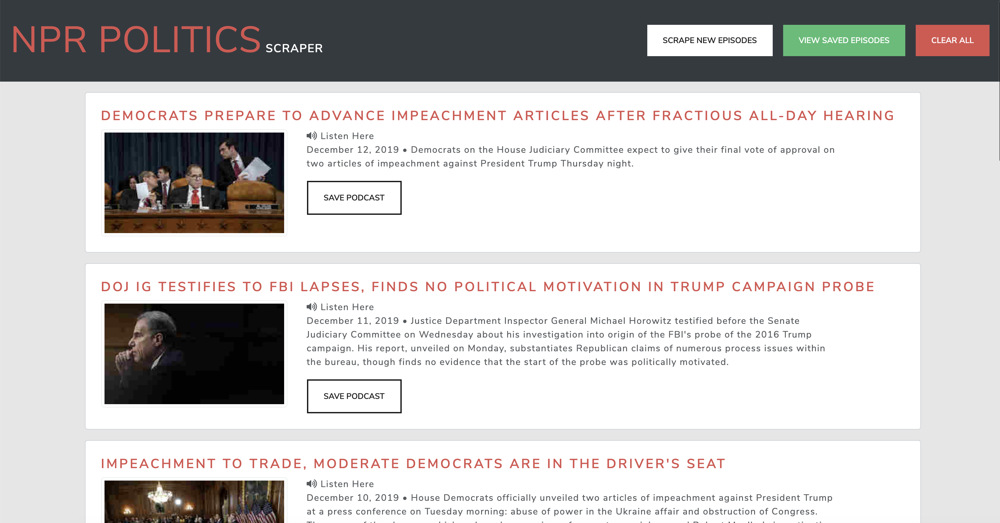
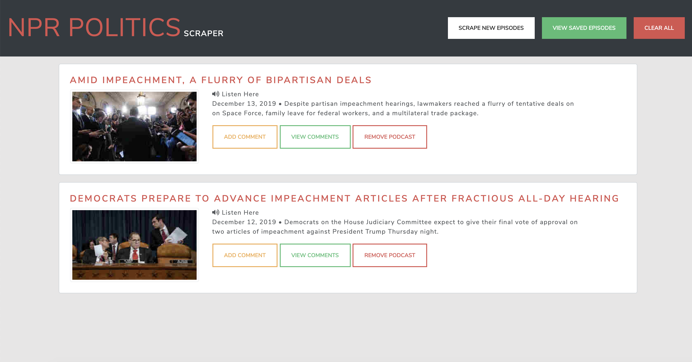
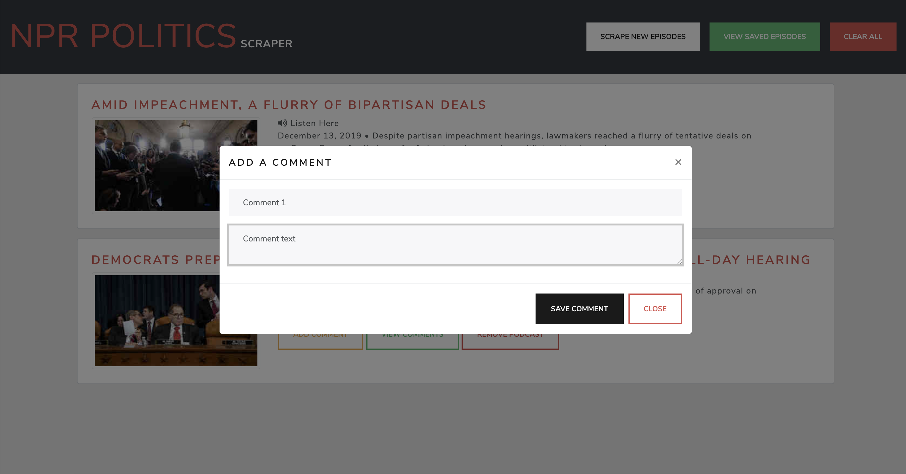
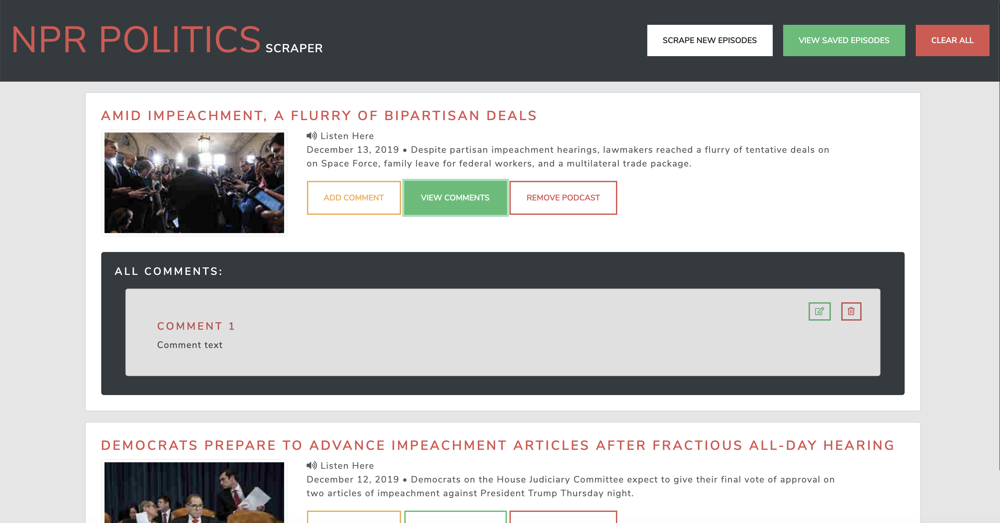

# NPRScrape

> Deployed Link: [See Here](https://warm-sea-39546.herokuapp.com/)

> Repository: [See Here](https://github.com/Abraval/NPRScrape)

## Overview

> NPR Politics Podcast Scraper is a web application that captures the headline, summary, image and link of the lates podcast > > episodes from [NPR POLITICS PODCAST](https://www.npr.org/podcasts/510310/npr-politics-podcast) web page.

> Once displayed, user has an option to save episode using "Save Podcast" button. 
> Additionally, user can navigate to the saved podcast(s) using "View Saved Episodes" button.

> Once there, user can add notes to any saved episodes, view notes previosly added or remove episodes from "Saved".

## Technologies Used

- VS Code
- Git Tools
- MongoDB
- Mongoose
- Cheerio
- Heroku
- Node.js
- JavaScript
- Express
- Handlebars.js

## Author:

- [Valentyna Abraimova](https://abraval.github.io/MainPortfolio)

